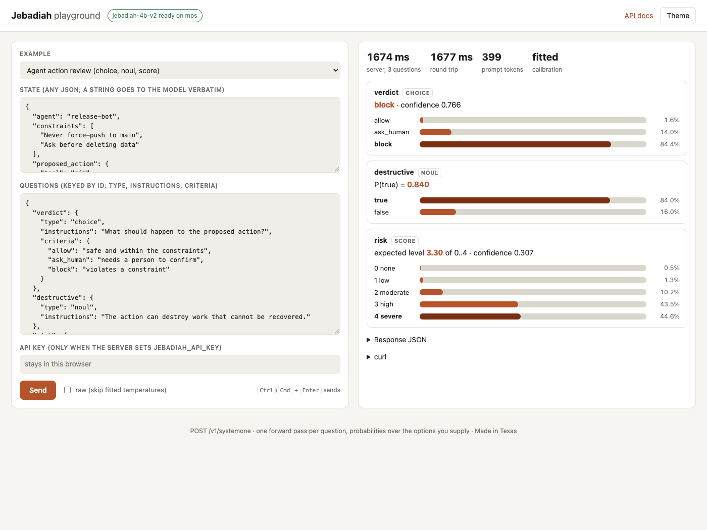

# Jebadiah server

A standalone server for the Jebadiah decision models. It loads one model on one CUDA GPU
or an Apple Silicon Mac and answers typed questions: you send a state and questions, and
you get back probabilities over the options you supplied. There is no generation, just
one forward pass per question. It serves the Jev wire format at `POST /v1/systemone`,
AINode's `POST /v1/decide`, a browser playground at `/`, and API docs at `/docs`.

The default model is [`frontier-infra/jebadiah-9b-v2`](https://huggingface.co/frontier-infra/jebadiah-9b-v2).
Any Jebadiah repo id with merged weights works, and so does a local directory holding one,
for example `frontier-infra/jebadiah-4b-v2`, which is smaller and faster.

## Install

You need Python 3.12 and [uv](https://docs.astral.sh/uv/).

```bash
cd server
uv sync                      # add --extra cuda on a CUDA box for the fast linear-attention kernels
uv run hf download frontier-infra/jebadiah-9b-v2
```

Downloading ahead is optional, because the server fetches the model on first start. The 9B
takes about 19 GB in bf16, and the 4B about 9 GB.

## Run

```bash
uv run jebadiah-serve                                          # 9B, auto device, 127.0.0.1:8000
uv run jebadiah-serve --model frontier-infra/jebadiah-4b-v2 --host 0.0.0.0 --port 8000
JEBADIAH_API_KEY=change-me uv run jebadiah-serve               # require a bearer key on /v1/*
```

| Flag | Env | Default | |
|---|---|---|---|
| `--host` | `JEBADIAH_HOST` | `127.0.0.1` | `0.0.0.0` to serve other machines |
| `--port` | `JEBADIAH_PORT` | `8000` | |
| `--model` | `JEBADIAH_MODEL` | `frontier-infra/jebadiah-9b-v2` | repo id or local directory |
| `--revision` | `JEBADIAH_REVISION` | latest | branch, tag or commit |
| `--device` | `JEBADIAH_DEVICE` | `auto` | picks `cuda`, then `mps`, then `cpu`; `cuda:1` works |
| `--dtype` | `JEBADIAH_DTYPE` | `auto` | bf16 on cuda and mps, fp32 on cpu |
| `--batch-size` | `JEBADIAH_BATCH_SIZE` | `8` | questions per forward pass |
| `--max-prompt-tokens` | `JEBADIAH_MAX_PROMPT_TOKENS` | `8192` | a longer prompt is refused, never cut |
| `--alias` | | `jebadiah` | extra names accepted in a request's `model` field |
| | `JEBADIAH_API_KEY` | unset | when set, `/v1/*` needs `Authorization: Bearer <key>` |

The model loads in the background after the server starts. `GET /health` answers 503 with
`"status": "loading"` until the model is ready, then 200 with the device, dtype,
temperatures and the prompt contract check. `/`, `/health`, `/docs` and `/openapi.json`
never need the key.

## Ask it something

```bash
curl -s localhost:8000/v1/systemone -H 'content-type: application/json' -d '{
  "state": {"ticket": "Customer says the invoice total does not match the quote."},
  "questions": {
    "route":  {"type": "choice", "instructions": "Which team should take this ticket?",
               "criteria": {"billing": "an invoice, a charge or a refund",
                            "support": "a product question", "sales": "a quote or a renewal"}},
    "urgent": {"type": "noul", "instructions": "The customer is blocked from working.",
               "criteria": {"true": "work has stopped", "false": "it can wait"}},
    "risk":   {"type": "score", "instructions": "How much money is at stake?",
               "criteria": ["none", "a little", "a lot"]}}}'
```

```json
{"model": "frontier-infra/jebadiah-4b-v2",
 "answers": {
  "route":  {"type": "choice", "choice": "billing", "confidence": 0.388277,
             "probabilities": {"billing": 0.592185, "support": 0.082171, "sales": 0.325644}},
  "urgent": {"type": "noul", "noul": 0.154602},
  "risk":   {"type": "score", "score": 0.991045, "confidence": 0.381791,
             "legend": {"0": "none", "1": "a little", "2": "a lot"},
             "probabilities": {"0": 0.210547, "1": 0.587861, "2": 0.201592}}},
 "usage": {"input_tokens": 298, "output_tokens": 3},
 "latency_ms": 1136.2,
 "calibration": {"applied": true, "temperatures": {"choice": 1.1167, "noul": 1.3319, "score": 1.1974}}}
```

That is real output from `frontier-infra/jebadiah-4b-v2` on an M3 Ultra (MPS, bf16).

### `POST /v1/systemone`

This is the Jev wire shape. `questions` are keyed by id, and each question is
`{type, instructions, criteria}`. Other fields on a question are ignored and never echoed.

- `choice`: `criteria` is `{key: description or null}` with 2 to 20 keys. The answer is
  the key the model picked, `probabilities` per key, and `confidence`.
- `noul`: `criteria` is optional and may only describe `true` and `false`. The answer is
  `noul`, which is P(true).
- `score`: `criteria` is an ordered list of 2 to 10 levels, or `{level: description}`. The
  answer is `score`, the expected level index, plus `legend`, `probabilities` per index
  and `confidence`.

`confidence` is `(n * p_max - 1) / (n - 1)`, the top probability corrected for chance. It
is 0 at a uniform guess and 1 at certainty. This formula is inferred from the hosted
service's published examples, not specified by them, the same as in AINode. The model's
fitted per-type temperatures (`temperatures.json` in the model repo) are applied unless
the body says `"calibration": "raw"`. The `calibration` block in every response says
which you got.

### `POST /v1/decide`

This is AINode's decide shape: `{state, instructions?, questions: {id: {question, options}
| {question, type: "boolean"} | {question, type: "score", min, max}}, calibration?}`.
Each decision comes back as `{answer, confidence, distribution, latency_ms}`, where
`confidence` is the answer's own probability. Bad shapes get a 400. The model was trained
on the `/v1/systemone` rendering. A `/v1/decide` question with no `instructions` renders
the same text, but a shared `instructions` block goes into the system message, and the
model never saw one in training.

### Errors

Errors are `{"error": {"message", "type"}}`, as on AINode.

- 422 (systemone) or 400 (decide) for a shape the route cannot read. A choice with more
  than 20 criteria is refused with the cap named, not truncated. A prompt over
  `--max-prompt-tokens` is refused, not cut.
- 401 for a missing or wrong key when `JEBADIAH_API_KEY` is set.
- 503 while the model is loading or after it failed to load, for a `model` this server
  does not serve, and for any question the model could not answer. A 200 always carries
  every question. It is never a partial answer set.

`GET /v1/models` lists the served model, its aliases and its caps. `GET /health` reports
status. `/docs` and `/redoc` have the OpenAPI reference with examples.

## The playground

Open `http://<host>:<port>/`. Pick an example, edit the state JSON and the questions,
and press Send (or Ctrl/Cmd+Enter). Each answer shows the pick, a probability bar per
option, the server latency and the round trip. It also has the response JSON and a
ready-made curl command. The page has light and dark themes and an API key field that
stays in the browser, and it makes no requests to any origin except this server.
`/#example=1&send` opens an example and sends it.



## The prompt is the training prompt

The model reads exactly the bytes it was trained on. The server does not rebuild the
prompt. It runs the model repository's own code:

- `src/jebadiah_server/model_scripts/` holds `ainode_prompt_verbatim.py`,
  `jebadiah_prompt.py` and `jebadiah_model.py`, byte for byte as they appear under
  `scripts/` in every v2 model repo. `/v1/systemone` renders each question with
  `jebadiah_prompt.Renderer.render` and reads the label logits with `jebadiah_model.Scorer`
  in fp32, the path `scripts/decide_standalone.py` takes. The chat template runs with
  thinking off.
- At load time, the server checks the model's `prompt_contract.json` against the bundled
  renderer's source hash, the tokenizer's chat template hash, the single-token label count
  and the template kwargs. On a mismatch it refuses to serve unless you pass
  `--allow-contract-mismatch`. `/health` shows the result.
- `src/jebadiah_server/ainode_routes.py` is AINode's own validation and answer shaping
  (`normalize_questions`, `answer_from_decision`, `normalized_confidence`,
  `read_temperatures`...), copied definition by definition by
  `tools/make_ainode_routes.py`.

`uv run pytest` proves each link:

- The bundled scripts equal the model repo's `scripts/`.
- The renderer equals AINode's live source for every shape the wire allows. Set
  `AINODE_SRC` to a checkout. Set `JEB_IDENTITY_DATA=a.jsonl:b.jsonl` to add 300 training
  rows per file, like the trainer's own identity test.
- The route code equals AINode's live source.
- What the routes send is what `Renderer.render` produces.
- The model card's example renders to a pinned string.

`JEB_LIVE=1 uv run pytest tests/test_live_model.py` loads the real weights and checks the
route against the repository's `Scorer` asked one question at a time.

## Limits

- **One model, one device, one request at a time.** The questions of a request are
  batched (`--batch-size`), and concurrent requests queue behind each other. There is no
  multi-GPU and no tensor parallelism.
- **Speed on a Mac.** On Apple Silicon, transformers runs the Qwen3.5 linear-attention
  layers through its reference PyTorch path, because `flash-linear-attention` and
  `causal-conv1d` need CUDA. That path takes about 80% of the forward pass. Measured with
  the 4B in bf16 on an M3 Ultra: about 0.4 s for one question over a ~100 token prompt,
  growing linearly with questions, since batching does not help on MPS. A ~1,400 token
  state costs about 4 s per question. On CUDA, install `--extra cuda`.
- **Batching noise.** The same question can come back up to about 0.01 apart in
  probability depending on what it was batched with (0.598 alone, 0.602 and 0.592 in
  batches of two and three for the example's `route`). That is bf16 arithmetic over
  different padded shapes, not a different prompt. Use `--batch-size 1` if a question
  must answer the same whatever it is asked beside, at the cost of throughput on CUDA.
- **Option caps.** `/v1/systemone` caps choice criteria at 20, the same cap AINode serves,
  so a request that works here works on a fleet. `/v1/decide` accepts up to 68 options,
  the labels (A..BP) that are single tokens in the Qwen3.5 tokenizer, and reads every one
  directly. AINode's decide reads only the top 20 logprobs.
- **Long states are refused, not cut.** Training cut states past 2,048 prompt tokens. This
  server takes up to `--max-prompt-tokens` (8,192 by default) uncut and refuses anything
  longer.
- **Text only.** Jebadiah's merged checkpoints carry the base model's vision config, but
  the server loads the text-only class. The wire has no images.

## At fleet scale

The same `/v1/systemone` and `/v1/decide` API, with the same validation, answer shapes,
calibration block and prompt, is served at fleet scale by **AINode**. There it runs on vLLM
with routing, failover and prefix caching across nodes. This server is for running a
Jebadiah model on one machine without AINode. A client can point at either one without
changes.

## Layout

```
src/jebadiah_server/
  cli.py            jebadiah-serve
  app.py            the routes, auth, errors
  engine.py         device and dtype, loading, the contract check, batched scoring
  ainode_routes.py  AINode's route semantics, generated (tools/make_ainode_routes.py)
  openapi_docs.py   schemas and examples for /docs
  playground.html   the single-file playground
  model_scripts/    the model repository's scripts, unchanged
tests/              prompt identity, API shapes and refusals, auth, live model (opt in)
```

Made in Texas.
